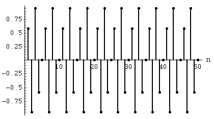
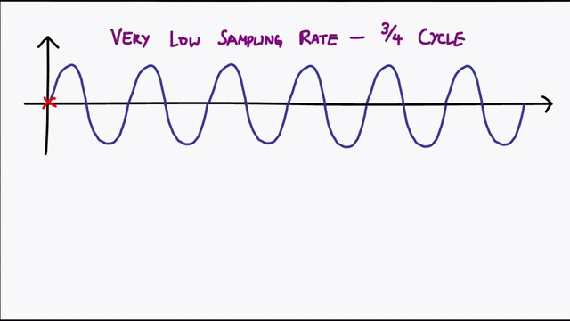
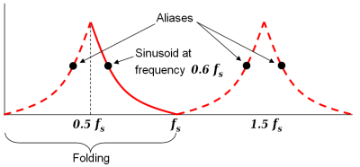

<meta charset="utf-8">
<meta name="theme-color" content="#141518" />
<meta name="apple-mobile-web-app-capable" content="yes">
<meta name="apple-mobile-web-app-status-bar-style" content="black">
<link href="https://fonts.googleapis.com/css?family=IBM+Plex+Mono|Roboto|Roboto+Mono" rel="stylesheet">
<link rel="stylesheet" href="../markdeep-style.css">

**Sampling and Aliasing Notes**

# Sampling

## Sampling Rate

Given a sinusoid of the following form:

$$
    \theta(t) = Asin(2 \pi f t + \phi)
$$

We wish to sample this signal into the following discrete form:

$$
    \theta(N) = Asin(2 \pi f_d N + \phi)
$$

where $N$ is the current sample, and $f_d$ is the discrete sampling rate.

## Aliasing

Given a discrete waveform, if the sampling rate is too low, the reconstructed waveform *can* be incorrectly reconstructed into a waveform with a lower frequency than that of the original waveform. This is caused by have a sampling rate less than the the Nyquist Rate.

The gif below shows off aliasing. Credit goes to [this](https://www.youtube.com/watch?v=yWqrx08UeUs) youtube video for making this demonstration.

### Nyquist Frequency vs Rate

Given a discrete sinusoid signal with frequency of $f_d$, the **Nyquist frequency** is equal to $\frac{1}{2}f_d$. The **Nyquist rate** is equal to $2f_s$, which is the *minimum* sampling rate required for a signal to not alias.

!!! theorem: Nyquist Frequency
    The **maximum** frequency that will not alias given a sampling rate. For all frequencies **below** the Nyquist frequency, there will not be any aliasing.
    
    In the image below, the Nyquist *Frequency* is $0.5f_s$. Signals less than or equal to $0.5f_s$ *will not* alias.

!!! theorem: Nyquist Rate
    The **minimum** sampling rate required for a frequency to *not* alias. It does need to be noted however, that this is *not* the value you should strive for if you are looking for the most faithful reconstruction of waveform. Sampling rates near the Nyquist rate will have the correct frequency, but their amplitudes will vary greatly. For most uses, it is recommend to sample at 5x to 10x the frequency, rather than just 2x.

    In the image below, the Nyquist *Rate* is $2f_s$, which is not shown.
    

The above image shows the frequency spectrum of a wave, with $f_s$ being the sampling rate. The point at $0.6f_s$ is used and its aliases are displayed as the other black dots.

If a given waveform has a frequency of $0.6f_s$, then it will be considered *undersampled*. This is due to its Nyquist rate being equal to $2\cdot0.6f_s=1.2f_s$, which is greater than the sampling rate, $f_s$. This waveform will also alias, as it is greater than the Nyquist frequency in this sampling scenario, $.5f_s$.

It is important to remember the differences between the Nyquist Frequency and Rate. The Nyquist Frequency describes the range of *nonaliased* frequencies than can be discretized using a specific sampling rate. It inherently describes the possible outputs using only the sampling rate *not* the input signals. The Nyquist Rate, on the other hand, describes the minimum sampling rate needed to not alias a given signal. It describes the requirements to not alias a signal given *only* the input signal, and *not* the sampling rate. The two are very similar concepts, almost describing the same concept, but are instead just approaching it at two different directions.

### Finding Aliases

Now that we know *when* a signal will alias, we wish to find at what frequency that aliased signal will be at. The given equation below describes in general how to find the aliased frequency, given the input frequency and the sampling frequency.

$$
    \begin{equation}
    f_a = |N\cdot f_s - f|
    \end{equation}
$$

where $f_a$ is the aliased frequency, $N$ is any integer, $f_s$ is the sampling frequency, and $f$ is the input signal frequency. 

The $N$ value is always a value that shifts the signal frequency to the closest point near the input signal. For example, with an input, $f$ of 210KHz and a sampling frequency, $f_s$ of 100KHz, the N value would be $2$, as this would shift the sampling frequency to position closest to $f$. Thinking about aliasing and sampling by viewing a spectrum of frequencies (frequency domain) rather than a linear section of time (time domain) makes finding reasonable solutions to these types of problems much easier.

<!-- Markdeep: -->q